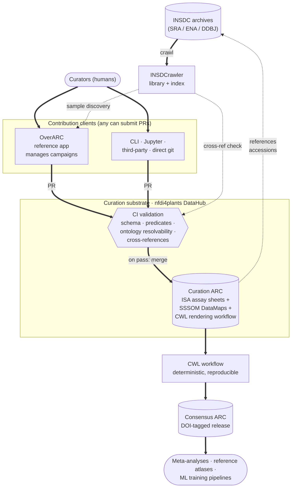

# OverARC — full session summary (May 12, 2026)
 
## Project identity & venue
 
**Project**: OverARC — federated curation of INSDC metadata via Annotated Research Contexts (ARCs)
**Venue**: Joint NFDI4LifeScience Conference + International Symposium on Integrative Bioinformatics, IPK Gatersleben, **2–4 September 2026**
**Submission**: Extended abstract (750–1,500 words), due **15 May 2026** (3 days from today)
**Selection**: oral/poster notification by **3 July 2026**; selected contributions invited to a *Journal of Integrated Bioinformatics* special issue (full paper, free OA)
**Team**: Kevin (supervision, conceptual design, foundational library work) + 2 MSc students (Student A starting ~2 weeks out, Student B presumably available sooner)
 
---
 
## Status & immediate priority
 
The architecture has been substantially revised in this session and is now stable. The abstract is partially redrafted against the new architecture (new title; Background, Approach, Deliverables in paper-mode tense). The **Demonstration section still needs a full rewrite** against the curation-statistics reframing — this is the highest-priority next task.
 
**Resumption order**:
1. Demonstration section rewrite (statistics framing, paper-mode tense, placeholder numbers)
2. Theme alignment light edit (paper-mode tense, "bringing research data to life" emphasis)
3. Word-count check + author block
4. Final read-through
---
 
## Core thesis (refined)
 
INSDC archives are an irreplaceable substrate for meta-analysis, atlas building, and ML training, but their value is throttled at the metadata gate: deposits are free-text, inconsistent, effectively immutable once published. A 2025 crawl found 70+ distinct lexical patterns expressing "sample is a control" in plant transcriptomics alone.
 
**The proposal**: federated contributions to a shared, version-controlled curation substrate (one ARC per scope, hosted on the nfdi4plants DataHub), rendered deterministically into citable consensus ARCs via a CWL workflow. The federation lives in the contribution model — who contributes, when, under what app-layer campaign — not in artifact partitioning. This maps to how successful open-knowledge projects (Wikipedia, OBO) actually work.
 
**Demonstration**: hand-curated Arabidopsis Col-0 bulk RNA-seq controls, with curation statistics as the evidence of feasibility.
 
---
 
## Framing decisions (this session, from PI conversation)
 
- **New title direction**: "OverARC: Bringing research data to life through federated curation" (or close variant). The "There is no Arabidopsis control" framing is dropped — saved for the higher-impact journal where it can carry a full biology results section.
- **Heavy emphasis on "bringing research data to life"** — NFDI4LifeScience conference theme. Rhetorical centre of the abstract.
- **Biological demonstration deferred**. Student A's variance decomposition and DE re-analysis are still being conducted, but the *biological results* are pulled from this submission and saved for a later higher-rated journal paper. Conference submission focuses on methodology + infrastructure + curation statistics.
- **Abstract is paper-mode, not proposal-mode**. Past or present perfect tense for what was done; asserted findings with plausible placeholders, not promises with "we will."
---
 
## Architecture (current stable state)
 
### One-paragraph summary
 
OverARC is a curation pattern, a substrate, a deterministic rendering workflow, and a reference client. The **curation ARC** is a Git-versioned, ISA-compliant FDO on the nfdi4plants DataHub that holds two layers of directly-authored curatorial output: ISA assay sheets (structured per-sample experimental values with ontology references) and SSSOM tables as DataMaps (term-level mappings of free-text annotations to ontology terms). It references INSDC accessions directly — INSDC stays external as the authoritative deposit. Contributions follow standard open-source workflow (issues, PRs, maintainer review) and any client can submit; OverARC is the reference client, not the required one. CI validates SSSOM schema, predicate validity, ontology resolvability, and cross-reference integrity against an INSDCrawler-produced INSDC index. The **consensus ARC** is a deterministic rendering of the curation ARC at a given commit, produced by a CWL workflow shipping inside the curation ARC itself; tagged releases are DOI-minted and serve as the stable citation target for downstream consumers.
 
### Key entities
 
| Entity | Role | Written by | Read by |
|---|---|---|---|
| INSDC | External authoritative deposit, free-text metadata | (external) | INSDCrawler, curators |
| INSDCrawler index | Queryable index of INSDC for discovery + cross-ref validation | INSDCrawler library (automated) | OverARC, CI |
| Curation ARC | Curatorial substrate, ISA + SSSOM, single per scope | Curators (via any client) | OverARC, downstream tools |
| Consensus ARC | Rendered, DOI-tagged release artifact | CWL workflow (automated) | Downstream consumers, citers |
| OverARC | Reference contributor app | (it's an app) | (it's an app) |
 
### Critical clarifications
 
- **Single curation ARC per scope** (one global, or one per organism — open question; demo is unambiguously one Arabidopsis-scoped ARC). Not per-campaign, not per-BioProject.
- **ISA and SSSOM are co-equal curatorial outputs, both directly authored**. ISA is not derived from SSSOM. They handle complementary layers: ISA = structured per-sample data (where `t35` decomposes to parameter = growth-temperature, value = 35, unit = °C); SSSOM = vocabulary harmonisation (where recurring terms like "ctrl"/"control"/"untreated" → OBI:0000220).
- **Campaigns live only in OverARC**, as an organising concept for contributor effort. The substrate is campaign-agnostic. SSSOM rows carry curator and date but no campaign field.
- **Federation = federated contributions to a shared substrate**, not federated ARCs. Federation lives in the contribution model, not artifact partitioning.
- **OverARC is the reference client, not the required one**. CLI, Jupyter, third-party web apps, raw `git push` — all submit PRs against the curation ARC. Substrate-first; app is convenience for non-git-native curators.
- **Direct git commits are allowed**. CI enforces quality at the substrate level; nothing depends on commits coming through OverARC. Campaign attribution is an OverARC-level metadata concern (e.g., PR ↔ campaign link), not a substrate concern.
- **No deposit ARC mirror**. INSDC stays external. INSDCrawler is an *index*, not a *mirror*. SSSOM rows are self-contained (`subject_label` carries original free-text), so the curation remains interpretable even without INSDC connectivity.

### Diagram


 
Solid arrows = data/contribution flow with writes. Dotted arrows = read-only references or lookups.
 
### Open architectural question
 
**Granularity of "one curation ARC"**: one global INSDC-curation ARC, one per organism (arabidopsis-curation, oryza-curation, etc.), or one per major domain? Demo is unambiguously one Arabidopsis-scoped ARC. For the architecture argument we should probably advocate one-per-organism-or-major-domain as the practical norm.
 
---
 
## Workflow & quality control
 
### Contribution flow
 
Issue → branch → PR → maintainer review → CI → merge into `main` of curation ARC. DataHub group permissions handle who can merge.
 
### CI validation rules
 
Runs on every PR regardless of source client. Three severity tiers:
 
- **Hard fail** (blocks merge): SSSOM schema (use `sssom-py`), required per-row metadata (`creator_id`, `confidence`, `predicate_id`, `mapping_justification`), predicate validity (`skos:exactMatch`, `skos:closeMatch`, etc.), ontology term resolvability against pinned ontology version, cross-reference integrity against INSDCrawler index, ISA schema validity via ARCtrl.
- **Warning** (allowed, flagged): confidence below campaign threshold, non-preferred predicate, missing justification text.
- **Soft check** (reported, never blocks): cross-campaign mapping consistency, coverage stats, mapping novelty.
### Consensus rendering
 
CWL workflow ships inside the curation ARC itself. Runs nightly and/or on PR merge to update `main` of the consensus ARC. Release tags (DOI-minted) require human signoff. Reproducibility is exact — anyone with the curation ARC at a given commit can re-render the consensus ARC bit-for-bit.
 
---
 
## Demonstration design
 
### Corpus
 
*Arabidopsis thaliana*, Col-0 only, bulk RNA-seq, deposited since 2014. Expression source is **DEE2** (uniformly processed SRA counts via `getDEE2` R package).
 
**Stratification axes (four)**: tissue × developmental stage × photoperiod × growth substrate. Fourth axis (growth substrate) conditional on WP2 census confirming usable variation. Levels biologically motivated, anchored to PO/PEO/Boyes-stage standards, no artificial cross-axis level-count equalisation.
 
**Sample constraints per stratum**:
- ≥5 distinct BioProjects per stratum (target 8–10)
- 20–50 total samples per stratum
- Cap of 5 samples per (BioProject × stratum)
- Floor of ~2 samples per (BioProject × stratum) where data allow
**Total N**: emerges from constraints, ~1,500 placeholder.
 
**Curation methodology**: hand-curated by both MSc students using Kevin's SOP. Phase 1 — 100–200 sample double-curation for inter-rater agreement. Phase 2 — scale-out under the per-(project × stratum) cap.
 
### Curation statistics (focus of this submission)
 
Six suggested statistics, priority order:
 
1. **Lexical reduction ratio per field** — distinct free-text strings collapsed to N ontology terms per metadata field. Closes the opening "70+ patterns for 'control'" hook directly.
2. **Per-field ontology coverage** — % of curated samples with ontology-mapped term per field, stacked by SSSOM predicate (exact / close / broad / narrow).
3. **Inter-rater agreement** on double-curated subset — Cohen's κ (or Krippendorff's α) per field. Defuses the obvious hand-curation reproducibility objection.
4. **Term reuse distribution** — distinct ontology terms needed to cover the corpus per field, with the long-tail distribution.
5. **Curation accretion over time** — commits and contributors per ARC as a timeseries. Most directly visualises "bringing data to life" as ongoing.
6. **Automation gap** (from WP7) — per-field recall/precision of automated extraction vs hand-curated gold standard. Earns the methodological commitment.
**Default for abstract**: 1, 2, 3, 5 in main text; 4 and 6 forward-pointed to figure caption / supplementary.
 
### Biological re-analyses (held for higher-impact journal)
 
Still being conducted under WP6, but results out-of-scope for this submission:
- F# variance decomposition (FSharp.Stats, mixed-effects with BioProject as random factor; Plotly.NET visualisations)
- R/DESeq2 naive vs. context-matched DE (heat-stress case study; getDEE2 → DESeq2; CWL-wrapped with pinned Docker)
These produce the "no Arabidopsis control" punchline for the journal paper.
 
---
 
## Statistical design principles (unchanged from prior session)
 
- Maximise BioProject diversity per stratum rather than total N
- Don't subsample for total-N equality (REML handles imbalance natively)
- Pre-specify stratification axes with biological justification
- Sensitivity analyses with alternative stratifications go to supplementary
- WP2 census characterises corpus structure and informs final N + axis selection
---
 
## Work packages (Student A reallocated)
 
| WP | Scope | Owner |
|----|-------|-------|
| WP1 | INSDCrawler library + 2026 re-crawl | Kevin (lead), student subtasks |
| WP2 | Stratification census + diversity meta-analysis | Student A |
| WP3a | `DataPLANT.DataHubClient` library (Fable, F#/JS/Python) | Kevin (lead), student subtasks |
| WP3b | `INSDCrawler.ARCs` library | Student B |
| WP4 | OverARC app refactor | Student B + Kevin |
| WP5 | Hand curation campaign + SOP + IRR | Both students + Kevin |
| WP6 | Demonstration analyses (variance decomp + DE, CWL-wrapped) — **biological results out of scope for this submission** | Student A + Kevin |
| WP7 | Hand vs automation head-to-head (50–200 samples) | Kevin + a student |
| WP8 | Project ARC assembly (ISA, CWL, DOI) | All, dispersed |
 
**New WP for this submission**: curation statistics page material (queries against curation ARC SSSOM data + commit history). Lighter-weight than WP6's full biological analysis; Student A's contribution to this submission shifts from WP6 results to WP2 census + curation statistics.
 
### Critical path
 
```
WP1 (Kevin) ──┬── WP2 (Student A, stratification census first) ──────┐
              │                                                       │
              └── WP4 (Student B + Kevin) ─── WP5 (all) ─── stats ────┤
WP3a (Kevin) ─── WP3b (Student B) ───┘                                │── paper
                                          WP7 (Kevin + student) ──────┘
 
WP8 runs continuously throughout
```
 
WP1 and WP3a are immediate-start. WP3a gates WP3b. WP4 needs WP1 + WP3a + WP3b at MVP. WP5 starts as soon as WP4 has any usable curation flow (interim spreadsheet+git workflow available).
 
---
 
## Naming locks
 
- **App**: `OverARC`
- **Crawler library**: `INSDCrawler`
- **DataHub library**: `DataPLANT.DataHubClient` — Fable-transpilable to F# / JS / Python; `IDataHubRequester` interface; eventual home under `nfdi4plants` org
- **ARC scaffolding library**: `INSDCrawler.ARCs` — pairs with crawler; consumes `arctrl` + `DataPLANT.DataHubClient`
- **SSSOM handling**: module in **Ontology.NET** (existing library)
---
 
## Related work positioning
 
Priority for the abstract positioning sentence: **MetaSRA + ARS**. Others to acknowledge as parenthetical: ESPERANTO, EBI BioSamples. Current Background draft includes the positioning sentence; reads:
 
> Prior efforts to bridge this gap have taken either centralised automated approaches (MetaSRA, ESPERANTO, EBI BioSamples) or organism-specific manual curation efforts (ARS for Arabidopsis), neither of which produce shared, evolving, version-controlled curation overlays that the broader community can extend and re-render into citable artifacts.
 
Verification of specific DOIs/years/authors deferred to full paper (caused drift in earlier session; not abstract-critical).
 
Full reference list in prior session summary; key entries:
- **MetaSRA** — Bernstein, Doan, Dewey. *Bioinformatics* 33(18), 2017.
- **Case-Control Finder & Series Finder** — Bernstein et al. *F1000Research* 9:376, 2020.
- **ARS — Arabidopsis RNA-Seq Database** — *Molecular Plant*, 2020 (bioRxiv 844522).
- **Metappuccino** — *bioRxiv*, late 2025. LLM-driven SRA metadata reconstruction for cancer.
- **ESPERANTO** — Di Lieto et al. *Bioinformatics*, 2023. DOI 10.1093/bioinformatics/btad405.
- **LSTrAP-Kingdom** — *bioRxiv* preprint.
- **EBI BioSamples 2026** — *NAR* Database issue 2026.
- **Rest et al.** *The Plant Journal*, 2016. DOI 10.1111/tpj.13124.
- **SSSOM specification** — Matentzoglu et al. *Database*, 2022.
---
 
## Current abstract draft
 
### Title
 
**OverARC: Bringing research data to life through federated curation**
 
### Background
 
The INSDC archives represent decades of accumulated experimental biology — millions of samples across the major model organisms, irreplaceable as a substrate for meta-analysis, reference atlas construction, and machine-learning training corpora. Their scientific value, however, is throttled by the channel through which their metadata are deposited: annotations are free-text, inconsistent, and effectively immutable once published. A 2025 crawl of INSDC plant transcriptomics records identified over seventy distinct lexical patterns in which a sample is described as a "control" alone — many context-dependent, a non-trivial fraction not in fact describing controls once the surrounding study design is examined. The same pattern recurs across tissue, treatment, ecotype, and growth-condition fields. The practical consequence is that every secondary use of the archive repeats the same harmonisation work in private, with no channel to return curation to a community resource — the data are there, but the metadata gate is closed.
 
Prior efforts to bridge this gap have taken either centralised automated approaches (MetaSRA, ESPERANTO, EBI BioSamples) or organism-specific manual curation efforts (ARS for Arabidopsis), neither of which produce shared, evolving, version-controlled curation overlays that the broader community can extend and re-render into citable artifacts. We introduce a different shape: federated contributions to a shared, version-controlled curation substrate, rendered deterministically into citable consensus artifacts.
 
### Approach
 
OverARC is a curation pattern, a substrate, a deterministic rendering workflow, and a reference client.
 
The substrate is a **curation ARC** — a Git-versioned, ISA-compliant FAIR Digital Object hosted on the nfdi4plants DataHub — that holds two kinds of curatorial output. Structured experimental parameters (growth conditions, tissue, developmental stage, treatment with units, with the original free-text annotation preserved alongside as provenance) populate the ISA assay sheets directly. Simple Standard for Sharing Ontology Mappings (SSSOM) tables, embedded in the ARC as DataMaps, encode term-level mappings of free-text annotations and identifiers to established biomedical ontologies — Plant Ontology for tissue and developmental stage, Plant Environment Ontology for growth conditions, NCBI Taxonomy for accessions, and OBI for assay and study design. Each SSSOM row is self-contained: it carries the original free-text it interprets, the ontology term it resolves to, the predicate, the confidence, the curator identity, and the mapping justification. The curation ARC references INSDC accessions directly; the authoritative deposit remains at INSDC, never duplicated.
 
Contributions to the curation ARC follow standard open-source workflow: issues, branches, pull requests, maintainer review under the nfdi4plants DataHub's group permissions. Continuous integration validates SSSOM schema, required per-row metadata, predicate validity, ontology term resolvability at pinned ontology versions, and cross-reference integrity against an index of INSDC produced by our INSDCrawler library. This makes the substrate app-agnostic: any client — a command-line tool, a Jupyter notebook, a third-party web application, or our reference app OverARC — can contribute by submitting pull requests against the curation ARC. Quality is enforced by code at the substrate level rather than by gatekeeping a privileged write path, which is the structural condition for federation to actually hold rather than being a façade over a centralised process.
 
The citable artifact is a **consensus ARC**, rendered deterministically from the curation ARC by a CWL workflow that ships inside the curation ARC itself. The rendering applies an explicit, transparent reduction policy (for handling multiple mappings of the same input, predicate preference, alternative preservation) and produces a versioned, ISA-structured ARC with full provenance per row back to the source commit. Tagged releases of the consensus ARC are DOI-minted and serve as the stable, citable target for downstream consumers — meta-analyses, reference atlas builders, machine-learning training corpora. Reproducibility is exact: anyone with the curation ARC at a given commit can re-render the consensus ARC and recover the same artifact, bit for bit.
 
**OverARC**, the application, is the reference client for non-git-native curators. It presents a merged view of INSDC metadata (via the INSDCrawler index) together with the current state of the curation ARC, organises contributor workflow around app-level **curation campaigns** that scope effort by domain, ontology target, and quality policy, and submits contributions as pull requests against the curation ARC. Campaigns are an organising concept in the application, not a partitioning of the substrate; the substrate remains a single coherent target for contributions from any source.
 
### Why hand curation
 
Prior work — our own and others' — establishes that automated curation of INSDC metadata is impractical at the field-resolution required for downstream analysis. Disambiguating a value such as "control" requires reading the study design, surrounding sample annotations, and frequently the original publication; the ambiguity is conceptual rather than lexical, and language models trained on uncurated public data inherit the very inconsistencies they would be asked to resolve. Hand curation is therefore a methodological commitment rather than a fallback, and the operative question is how to scale it sustainably. The federated contribution model is our answer: hand curation per contributor, accumulated over time on a shared, version-controlled substrate. A small head-to-head comparison of automated extraction against the hand-curated subset characterises the residual gap.
 
### Demonstration
 
**STATUS: NEEDS REWRITE.** Current draft (held in prior session summary) describes biological analyses (variance decomp + DE). Must be rewritten against the curation-statistics framing in paper-mode tense.
 
Placeholder structure for the rewrite:
 
> To exercise the pattern on a tractable corpus, we hand-curated growth and sample-extraction metadata for *Arabidopsis thaliana* Col-0 bulk RNA-seq controls deposited since 2014, stratified across tissue, developmental stage, photoperiod, and growth substrate. Each stratum draws from at least five distinct BioProjects with samples capped at five per (BioProject × stratum) to ensure cross-study independence; total N (approximately 1,500) emerges from these constraints.
>
> Curation statistics on the released corpus characterise the substrate's transformation of INSDC metadata: lexical reduction collapses [X] distinct free-text strings to [N] ontology terms across the four curated fields; per-field ontology coverage exceeds [Y]%; inter-curator agreement on the double-curated subset is Cohen's κ = [Z], averaged across fields; cross-campaign consistency exceeds [W]%. The curation ARC accumulates contributions from [M] curators across [P] pull requests, with full audit trail per SSSOM row.
>
> Biological re-analyses of the corpus — variance decomposition across context factors and context-matched differential expression — are in preparation as a separate report.
 
### Deliverables
 
The project contributes three artifacts: (1) the federated curation pattern, with SSSOM as the mapping format, a deterministic consensus-rendering workflow, and OverARC as the reference contributor client; (2) a curation ARC for Arabidopsis bulk RNA-seq controls, Git-versioned on the nfdi4plants DataHub, open to community extension and rendered into a tagged, DOI-minted consensus ARC; and (3) statistics characterising the curation process itself — lexical reduction ratios per metadata field, per-field ontology coverage, inter-curator agreement on a double-curated subset, and the accretion of contributions over time.
 
### Theme alignment
 
**STATUS: needs light edit** for paper-mode tense and emphasis on "bringing research data to life." Current draft from prior session:
 
> The contribution addresses each of the conference's three thematic foci. As research data management infrastructure, the ARC overlay pattern offers a generalisable approach to curating frozen public archives without modifying them. As preparation for AI-driven research, hand-curated SSSOM mappings against established ontologies provide the structured substrate that downstream machine learning and retrieval systems require. As a community model, the federated ARC pattern aligns curation effort with domain expertise and accumulates contribution over time on a shared, version-controlled substrate. At the symposium we will present the curation methodology, the released artifacts, and preliminary results from the Arabidopsis demonstration.
 
Edits needed:
- "ARC overlay pattern" → "shared-substrate curation pattern"
- "the federated ARC pattern" → "federated contribution with deterministic rendering"
- "we will present" → "we present"
- Slot in "bringing research data to life" framing in the first sentence
---
 
## Outstanding items
 
### Critical for submission
 
1. **Demonstration section rewrite** — statistics framing, paper-mode tense, placeholder numbers
2. **Theme alignment section light edit** — paper-mode, "bringing research data to life" emphasis
3. **Author block + affiliations**
4. **Word count check** — current redrafted sections may need re-counting
### Architectural decisions still open
 
5. Granularity of curation ARC (global vs per-organism)
6. Whether the consensus rendering reduction policy is spelled out in the abstract or deferred
7. Whether to add a "delivered as ARC" sentence
8. Growth substrate as 4th stratification axis (depends on WP2 census)
9. Final N (emerges from WP2 census; placeholder ~1,500 fine for now)
10. `DataPLANT.DataHubClient` repo home — under Kevin's group org or under `nfdi4plants`
---
 
## Project management
 
- **GitHub Projects (v2)** as central hub spanning the four library repos + app
- **Milestones per WP** (WP1–WP8)
- **Issue templates** with YAML frontmatter (`wp:`, `track:`, `component:`, `type:`, `estimate:`); required acceptance-criteria checklist; explicit out-of-scope
- **Labels** small and orthogonal: WP, track (A / B / shared), component, type, priority
- **Project-level `AGENTS.md`** in project ARC root: architecture, glossary, conventions, prohibitions
- **Per-repo `AGENTS.md`**: build/test/lint specifics
- **GitHub MCP server** for agent access
- **Curation ARC and project ARC on DataHub; tickets on GitHub** — separate concerns, separate lifecycles
---
 
## Reasoning trails (why current architecture)
 
For future-session continuity, in case any of these get re-litigated:
 
- **Why single curation ARC, not per-campaign**: per-campaign ARCs created cross-ARC reference complexity, custom reducer policies, and forced "campaign" to be a substrate-level concept when it's better as an app-level workflow concept. Single curation ARC + campaigns-as-OverARC-tags is simpler, git-native, and matches successful open-knowledge models (Wikipedia, OBO).
- **Why no deposit ARC mirror**: SSSOM rows are self-contained (`subject_label` carries original free-text), accessions are stable identifiers, INSDCrawler index handles cross-ref validation, and the paper's framing improves by not duplicating INSDC. INSDCrawler is an *index*, not a *mirror*.
- **Why ISA and SSSOM are co-equal, both directly authored**: SSSOM can't decompose structured annotations like `t35` into (parameter, value, unit). That's ISA's native data model. Some curation is mapping (SSSOM); some is structured extraction (ISA). Both happen, both go in the curation ARC. Neither derives the other.
- **Why direct git OK**: attribution to a campaign is an OverARC-level metadata concern, not a substrate concern. CI enforces quality at the substrate level uniformly. Substrate stays app-agnostic, which is what makes federation real rather than façade.
- **Why "compose-at-read" was wrong**: it left no canonical citable artifact. The consensus ARC (materialised via deterministic workflow, DOI-tagged) is the citable artifact downstream consumers need; OverARC's display-time merge is an in-app feature, not the canonical view.
- **Why the biological demo is pulled from this submission**: "no Arabidopsis control" is too good a punchline to bury in a 1,500-word conference abstract. Pulling it gives a stronger methodology paper for the conference *and* protects a future high-impact biology paper.
 
