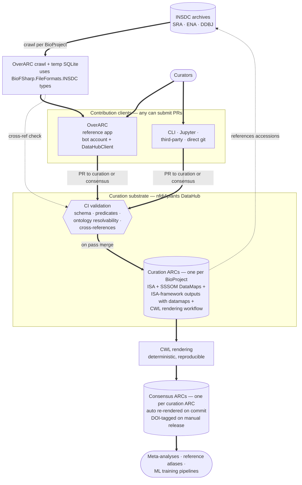

# OverARC — paper plan

## 1. Identity

**Project**: OverARC — federated curation of INSDC metadata via Annotated Research Contexts (ARCs).

**Venue**: Joint NFDI4LifeScience Conference + International Symposium on Integrative Bioinformatics, IPK Gatersleben, 2–4 September 2026. Submissions are extended abstracts (750–1,500 words); selected contributions are invited to a *Journal of Integrated Bioinformatics* special issue as full, open-access papers.

**Team**: Kevin Schneider (supervision, conceptual design, foundational library work) and two MSc students.

## 2. Thesis

The INSDC archives are an irreplaceable substrate for meta-analysis, reference atlases, and ML training corpora. Their value is throttled at the metadata gate: deposits are free-text, inconsistent, and effectively immutable once published. A 2025 crawl of the plant transcriptomics slice found 70+ distinct lexical patterns expressing "sample is a control" alone, and the same pattern recurs across tissue, treatment, ecotype, and growth-condition fields.

OverARC proposes a different shape than centralised automated curation or one-off manual efforts: **federated contributions to a shared, version-controlled curation substrate**, rendered deterministically into citable consensus artifacts. The substrate is a collection of BioProject-scoped curation ARCs on the nfdi4plants DataHub. Auto-mappings cover the 1:1-resolvable fields with a paired SSSOM file; hand curation accumulates on top via standard open-source workflow.

The paper demonstrates this on Arabidopsis thaliana: wide-baseline auto-curation across a broad slice of accessions plus hand-curation on a subset, with statistics characterising both layers and a fresh analysis of the 2026 INSDC re-crawl.

## 3. Architecture

### Entities

| Entity | Role | Written by | Read by |
|---|---|---|---|
| INSDC (SRA / ENA / DDBJ) | External authoritative deposit; free-text metadata | (external) | OverARC crawl, curators |
| `BioFSharp.FileFormats.INSDC` | F# typing + SQL schema for INSDC records | (library) | OverARC, downstream tooling |
| OverARC crawl + temp SQLite | Per-session local cache of an accession's full record set (study/biosample/experiment/run) | OverARC | OverARC UI, baseline emission |
| `DataHubClient` | Creates and manages ARCs on the nfdi4plants DataHub; used by OverARC via a dedicated bot account | (library) | OverARC, downstream tooling |
| Curation ARC (one per BioProject) | Git-versioned ISA-compliant FDO; holds ISA sheets, SSSOM DataMaps, ISA-framework transformation outputs with datamaps, and the CWL rendering workflow | Curators (any client) | Tools, CI, CWL rendering |
| Consensus ARC (one per curation ARC) | Deterministically rendered citable artifact; auto-re-rendered on each curation-ARC commit; DOI-tagged on manual release | CWL rendering (automatic); humans (DOI release) | Downstream consumers |

### Curation ARC contents

Three co-equal curatorial layers, none derived from the others:

1. **ISA assay sheets** — structured per-sample experimental parameters with ontology references (e.g. growth conditions decomposed into parameter/value/unit triples).
2. **SSSOM tables as DataMaps** — term-level mappings of free-text annotations and identifiers to established biomedical ontologies (PO, PEO, NCBI Taxonomy, OBI, etc.). Each row is self-contained: original free-text, ontology term, predicate, confidence, curator identity, mapping justification.
3. **ISA-framework transformation outputs annotated by datamaps** — outputs of curation work that exceeds SSSOM's expressiveness (e.g. parsing a free-text title into multiple typed values). The datamap describes the transformation; the ISA framework holds the structured output.

A CWL workflow that performs deterministic consensus rendering ships inside the curation ARC.

### Diagram

Solid arrows = data/contribution flow with writes. Dotted arrows = read-only references or lookups.

### Key clarifications

- **One curation ARC per BioProject; one consensus ARC per curation ARC.** Federation is three-dimensional: many BioProject ARCs across the DataHub, contributors per ARC, and contribution entry points — OverARC is one client, but PRs can also be opened directly against either the curation ARC *or* the consensus ARC by any tooling.
- **ISA, SSSOM, and ISA-framework-with-datamap are co-equal**, all directly authored or auto-generated. None derives the others.
- **Auto-mapping on the initial commit** produces ISA values for 1:1-mappable fields paired with an auto-generated SSSOM file at ~0.8 confidence. There is no separate "baseline ARC" artifact — the baseline is the t=0 state of the curation ARC.
- **SSSOM = term-level harmonisation. ISA framework + datamap = structured transformations beyond SSSOM's expressiveness.**
- **Consensus rendering is automatic; DOI minting is manual.** Curation-ARC commits trigger re-rendering commits on the paired consensus ARC. DOI-tagged releases of the consensus ARC are explicit, human-initiated actions.
- **Substrate is client-agnostic.** OverARC is the reference contributor app, not the required write path. CI enforces quality uniformly at the substrate level.

### Open architectural questions

- Whether the consensus-rendering reduction policy (how multiple mappings of the same input collapse, predicate preference, alternative preservation) is spelled out in the abstract or deferred to the full paper.
- Bot-account governance: who operates the OverARC bot, and how PR attribution is preserved when the bot performs the initial commit on a user's behalf.

## 4. OverARC app workflow

1. User selects an accession (which resolves to a BioProject).
2. OverARC crawls INSDC for the full set of records associated with that BioProject — study, biosample, experiment, and run records — and persists them to a temp SQLite database using `BioFSharp.FileFormats.INSDC` types.
3. OverARC checks the DataHub (via `DataHubClient`) for an existing curation ARC for that BioProject:
   - **If absent**: a dedicated OverARC bot account creates the curation ARC on the DataHub via `DataHubClient`, adds the authenticated user as a member, and emits the **baseline initial commit** — 1:1-mappable fields populate ISA across all the BioProject's samples, paired with an auto-generated SSSOM file at ~0.8 confidence.
   - **If present**: OverARC opens the existing curation ARC and grants the authenticated user access for further contribution.
4. The curator works further — refines mappings (SSSOM), structures parameters (ISA), and for transformations that exceed SSSOM (e.g. parsing a title into N typed fields) writes an ISA-framework output annotated by a datamap.
5. All curatorial work is committed as further changes to that BioProject's curation ARC. Campaign attribution is OverARC-level metadata on the PR, not a substrate concern.

OverARC is one entry point. PRs from any tooling can target the curation ARC, and PRs can also target the consensus ARC directly. The bot-account + `DataHubClient` flow is specific to OverARC's first-touch convenience.

## 5. Workflow and quality control

### Contribution flow

Issue → branch → PR → maintainer review → CI → merge into `main` of the BioProject's curation ARC. DataHub group permissions handle who can merge. PRs may target the curation ARC or the consensus ARC; the CI rules below apply uniformly to the curation ARC.

### CI validation rules

Three severity tiers, run on every PR regardless of source client:

- **Hard fail** (blocks merge):
  - SSSOM schema (validated with `sssom-py`).
  - Required per-row metadata (`creator_id`, `confidence`, `predicate_id`, `mapping_justification`).
  - Predicate validity (`skos:exactMatch`, `skos:closeMatch`, etc.).
  - Ontology term resolvability against pinned ontology version.
  - Cross-reference integrity against the INSDC index produced by OverARC's crawl path.
  - ISA schema validity via ARCtrl.
- **Warning** (allowed, flagged): confidence below campaign threshold, non-preferred predicate, missing justification text.
- **Soft check** (reported, never blocks): cross-campaign mapping consistency, coverage stats, mapping novelty.

### Consensus rendering and DOI

The CWL workflow that renders the consensus ARC ships inside the curation ARC. Re-rendering runs automatically on every merge to `main` of the curation ARC; the consensus ARC's `main` is kept in sync without human intervention. DOI minting is a separate, explicit, human-initiated release action on a tagged commit of the consensus ARC. Reproducibility is exact: anyone holding a curation-ARC commit can re-render the consensus ARC bit-for-bit.

## 6. Demonstration

The demonstration leans on the auto-baseline mechanism to scale far beyond what hand curation alone could cover.

### Shape

OverARC generates baseline curation ARCs across a broad slice of Arabidopsis accessions (possibly all Arabidopsis accessions present in the 2026 re-crawl), each with auto-mapped ISA plus an auto-generated SSSOM file at ~0.8 confidence for the 1:1-mappable fields. Hand curation then accumulates on a subset — exercising the federation pattern in motion against a much larger backdrop than a hand-curated cohort would allow on its own.

### Statistics — two layers

**Baseline coverage** (across the auto-generated curation ARCs):
- Number of curation ARCs generated.
- Per-field auto-mapping coverage.
- Distribution of auto-SSSOM confidence values.
- ISA-completeness deltas attributable to the baseline commit alone.

**Hand-curation quality** (on the curated subset):
1. **Lexical reduction ratio per field** — distinct free-text strings collapsed to N ontology terms per metadata field.
2. **Per-field ontology coverage** — % of curated samples with an ontology-mapped term per field, stacked by SSSOM predicate (exact / close / broad / narrow).
3. **Inter-rater agreement on the double-curated subset** — Cohen's κ (or Krippendorff's α) per field.
4. **Term reuse distribution** — distinct ontology terms needed to cover the corpus per field, with the long-tail shape.
5. **Curation accretion over time** — commits and contributors per ARC as a timeseries.
6. **Automation gap** — per-field recall/precision of automated extraction vs. hand-curated gold standard.

Statistics 1, 2, 3, 5 in main text; 4 and 6 in supplementary or figure caption.

### Re-crawled 2026 INSDC snapshot analysis

Analysis of the crawled metadata artifact itself, not the underlying biological data. Candidate analyses, to be narrowed when the snapshot is run:

- **Lexical pattern enumeration**: the "70+ distinct patterns for *control*" result from the 2025 crawl, refreshed against the 2026 re-crawl and extended to additional fields (treatment, tissue, ecotype, growth condition, developmental stage).
- **Per-field free-text entropy / cardinality**: distinct-string counts per metadata field across the plant transcriptomics slice; long-tail shape of free-text values.
- **Cross-field consistency anomalies**: samples annotated as "control" in one field that disagree with their parameter values in another.
- **Structural characterisation**: distribution of record relationships across study/biosample/experiment/run; missing-metadata patterns; field-population rates per BioProject.
- **Temporal trend**: 2025 vs 2026 crawl comparison — characterising whether INSDC metadata practice is shifting over time.

### Out of paper scope

Biological re-analyses of the curated corpus — variance decomposition across context factors, context-matched differential-expression re-analysis — are deferred to a separate, higher-impact biology-focused report.

## 7. Deliverables

Three artifacts:

1. **The federated curation pattern + reference client** — OverARC, `DataHubClient`, `BioFSharp.FileFormats.INSDC`, the auto-baseline mechanism, and the deterministic CWL rendering workflow.
2. **The released collection of Arabidopsis per-BioProject curation ARCs** — baseline-populated across a broad slice, hand-curated on a subset — and their paired consensus ARCs on the nfdi4plants DataHub, open to community extension.
3. **Statistics**: baseline-coverage characterisation, hand-curation quality on the curated subset, and the 2026 INSDC re-crawl snapshot characterisation.

## 8. Work packages

| WP | Scope | Owner |
|----|-------|-------|
| WP1 | `BioFSharp.FileFormats.INSDC` types + SQL completion; 2026 re-crawl; canonical INSDC index for cross-ref validation | Kevin (lead), student subtasks |
| WP2 | Arabidopsis-wide baseline coverage analysis — how far auto-mapping reaches across the full Arabidopsis accession space | Student A |
| WP3a | `DataHubClient` completion; bot-account flows for ARC creation + user-membership management | Kevin (lead), student subtasks |
| WP3b | `INSDCrawler.ARCs` (ARC scaffolding helpers; possible rename) | Student B |
| WP4 | OverARC app refactor — multi-record crawl (study/biosample/experiment/run) → temp SQLite; `DataHubClient`-driven baseline-ARC creation via bot account; auto-SSSOM emission at 0.8 confidence | Student B + Kevin |
| WP5 | Hand-curation campaign on the curated subset; SOP; inter-rater reliability | Both students + Kevin |
| WP6 | Biological re-analyses (variance decomposition + context-matched DE) — **out of paper scope, deferred to later report** | Student A + Kevin |
| WP7 | Hand- vs. automation head-to-head on the curated subset | Kevin + a student |
| WP8 | Project ARC assembly (ISA, CWL, DOI) | All, dispersed |
| WP-stats | Baseline-coverage + hand-curation statistics + snapshot analysis — the analytical contribution for this paper | All, light-weight |

## 9. Naming locks

- **App**: `OverARC`.
- **INSDC typing + SQL**: `BioFSharp.FileFormats.INSDC` (GitHub; almost complete).
- **DataHub client**: `DataHubClient` — currently at <https://github.com/kMutagene/DataHubClient>, mostly done.
- **ARC scaffolding helpers**: `INSDCrawler.ARCs` — this name predates the no-separate-crawler decision; may want renaming (e.g. `BioFSharp.FileFormats.INSDC.ARCs` or `OverARC.ARCs`).
- **SSSOM handling**: module in `Ontology.NET`.

## 10. Related work positioning

Prior efforts to bridge the INSDC metadata gap have taken either centralised automated approaches (**MetaSRA**, **ESPERANTO**, **EBI BioSamples**) or organism-specific manual curation efforts (**ARS** for Arabidopsis). Neither produces shared, evolving, version-controlled curation overlays that the broader community can extend and re-render into citable artifacts. OverARC's contribution is structural: a substrate that accumulates community curation under CI-enforced quality and renders citable consensus artifacts deterministically.

Reference list (verification of specific DOIs/years/authors deferred to the full paper):

- **MetaSRA** — Bernstein, Doan, Dewey. *Bioinformatics* 33(18), 2017.
- **Case-Control Finder & Series Finder** — Bernstein et al. *F1000Research* 9:376, 2020.
- **ARS — Arabidopsis RNA-Seq Database** — *Molecular Plant*, 2020 (bioRxiv 844522).
- **Metappuccino** — *bioRxiv*, late 2025. LLM-driven SRA metadata reconstruction for cancer.
- **ESPERANTO** — Di Lieto et al. *Bioinformatics*, 2023. DOI 10.1093/bioinformatics/btad405.
- **LSTrAP-Kingdom** — *bioRxiv* preprint.
- **EBI BioSamples 2026** — *NAR* Database issue 2026.
- **Rest et al.** *The Plant Journal*, 2016. DOI 10.1111/tpj.13124.
- **SSSOM specification** — Matentzoglu et al. *Database*, 2022.
