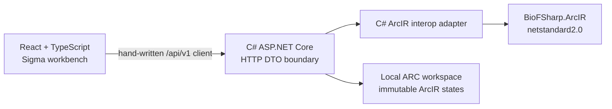

# OverARC read-only graph and term workbench

> **Status: implemented milestone (2026-08-28).** This viewer-first roadmap
> supersedes the earlier F# server, generated API client, and early editor plan.
> The sibling BioFSharp.INSDC roadmap remains authoritative for ArcIR, mapping,
> curation transactions, provenance, and native ARC processes.

## Decision and dependency boundary

ArcIR 1.0 is stable enough for graph projection, navigation, filtering, and
complete inspection. Its versioned JSON root, IRI-keyed terms/objects/relations,
assertions and annotations, canonical codec, and typed JSON selectors are stable.
The remaining core-library work adds diagnostics, mappings, transformations, and
ARC-native provenance around that state; it does not require the viewer to invent
or own those contracts.

OverARC therefore starts with immutable ArcIR states and stays deliberately
read-only. It does not write ArcIR, Git, the viewer manifest, an ARC, or the
sibling checkout. Editing becomes authoritative only when the Phase 6 core
libraries expose a curation transaction that can produce a new state and its
provenance/process artifacts atomically.

The application boundary is:



This split keeps the backend .NET-compatible without imposing Fable on the
frontend. F# maps, unions, options, and results terminate inside
`ArcIrInteropAdapter`; transport and UI contracts are ordinary C#/JSON and
TypeScript.

## Milestone scope

The first milestone is a curator-oriented, read-only desktop workbench:

- React 19, TypeScript, Vite, Pico CSS, Graphology, Sigma v3, and React Sigma;
- C# ASP.NET Core referencing only the sibling `BioFSharp.ArcIR.fsproj`;
- a repository-maintained fictional INSDC-like example workspace;
- listing and opening multiple immutable states, without comparison;
- object/relation graph projection with complete assertion and annotation detail;
- a first-class registered-term dictionary with compact usage summaries and
  complete on-demand occurrence details;
- semantic client-side search and filters with optional one-hop context;
- deterministic initial positions and worker-based ForceAtlas2 refinement;
- visible-canvas PNG and separate visible-node/visible-relation CSV exports; and
- one published loopback server containing the frontend and example workspace.

Explicitly excluded are editing, diagnostics, SSSOM, provenance/history views,
Git writes, DataHub access, external-workspace setup, and a manifest CLI.

## Repository and build

The solution contains `src/OverARC.Api`, `tests/OverARC.Api.Tests`, and the FAKE
build project. The React application remains independently built at the repository
root. The cross-platform entry points expose:

- `Restore` — restore the solution and run `npm ci`;
- `Build` — formatting gate, .NET build, TypeScript check, and Vite build;
- `Test` — backend, Vitest, and Chromium/Firefox Playwright suites;
- `Dev` — start ASP.NET on `127.0.0.1:5080` and Vite on `127.0.0.1:5173`; and
- `Publish` — embed `dist/` and the example workspace into the ASP.NET output.

`BIOFSHARP_INSDC_ROOT` selects the sibling checkout. The known local sibling
layout is the fallback. The devcontainer mounts that checkout at
`/workspaces/BioFSharp.INSDC`; CI checks out pinned commit
`8e0928e6ad031a559dbbf52c8cdb55051e2f4b48` before running FAKE.

Frontend formatting, linting, testing, and Pico conventions follow the adjacent
DataPLANT validation dashboard. Vite and Vitest are pinned beyond the vulnerable
versions reported by npm audit. FAKE's older vulnerable transitive packages are
overridden with patched compatible versions instead of suppressing audit warnings.

## Viewer workspace

Development uses:

```text
examples/viewer-workspace/
├── .overarc/viewer.json
└── arcir/states/
    ├── state-a.arcir.json
    └── state-b.arcir.json
```

The example covers parallel relations, a self-loop, a missing endpoint, nested
annotations, all ArcValue kinds, an unsafe 64-bit integer, a canonical floating
value, Unicode, and IDs containing `/` and `~`. The 10,000-object benchmark is
generated in tests and is never committed.

The manifest is viewer configuration, not provenance:

```json
{
  "formatVersion": "1.0",
  "name": "OverARC example workspace",
  "states": [
    {
      "id": "state-a",
      "label": "Example state A",
      "path": "arcir/states/state-a.arcir.json",
      "sha256": "<lowercase SHA-256>"
    }
  ]
}
```

State IDs are unique and URL-safe. Paths must remain below the workspace and may
not traverse reparse points/symbolic links. Digests bind exact immutable bytes.
Missing files, digest mismatches, unsafe paths, and invalid ArcIR documents remain
listed independently, so one bad state cannot prevent valid-state browsing.

The UI initially opens the valid state with the newest file modification time;
ordinal state ID breaks ties. This is a convenience only and carries no lineage
or “latest curated state” meaning. Refresh re-reads and revalidates without
writing, preserves the active valid state, and otherwise uses that same rule.

## HTTP boundary

The hand-written client uses:

- `GET /_health`
- `GET /api/v1/workspace`
- `POST /api/v1/workspace/refresh`
- `GET /api/v1/states/{stateId}/projection`
- `POST /api/v1/states/{stateId}/details`
- `POST /api/v1/states/{stateId}/term-details`

OpenAPI remains available at `/openapi/v1.json`. Errors use RFC 7807 problem
responses: unknown states/elements are `404`, listed invalid states are `422`, and
workspace configuration failures are `422`.

The projection returns exact IDs/selectors, compact term usage summaries, nodes,
directed relations, filter metadata, and projection-only placeholder nodes for
missing endpoints. Complete term occurrence lists are loaded only through the
term-details endpoint. `ArcValue.Ref` becomes a visually distinct derived
reference edge but never an `ArcRelation`.

Detail responses return every type assertion, property, nested annotation,
relation property, evidence/source reference, and selector. Integers and canonical
floats travel as strings so JavaScript never loses precision. Documents are cached
by canonical path and digest; a digest change invalidates the decoded state.

## Viewer semantics

The desktop layout has workspace/filter controls on the left, mutually exclusive
Graph, Table, and Terms center views, and the structured inspector on the right.
The accessible graph table exposes visible objects and relations. The independent
term table exposes every registered definition with source, usage counts, roles,
and complete on-demand occurrences without adding term nodes to Graphology.

Objects are graph nodes and ArcRelations are directed multiedges keyed by exact
relation IRI. Missing endpoints are amber placeholders. Derived reference edges
are purple. Terms label types and predicates but are not mixed into the domain
graph.

Curator-facing object labels use this precedence:

1. accession or archive accession;
2. primary identifier;
3. title;
4. name;
5. exact object IRI.

The inspector always exposes the exact IRI.

Search is Unicode-normalized and case-insensitive across backend-composed IDs,
labels, term/predicate labels, and rendered property/annotation values. Object
kind, object type, and relation predicate are independent filter categories. The
categories combine with AND; selected values within one category combine with OR.
Term search and source/usage-role filters use the same normalization and category
semantics but never alter graph visibility or graph exports.

Strict matching nodes remain prominent. One-hop context is on by default and is
dimmed. Context edges must touch a strict match; unrelated context-to-context edges
are hidden. With context off, only strict nodes and relations whose endpoints both
match remain. Predicate filters determine which relations are traversable.

Only the active state ID is stored in the URL. Filters and the active center view
survive state changes; selection, camera, node positions, and worker layout state
do not. Center-view changes alone preserve the selected object, relation, or term.

Coordinates are deterministically seeded from exact node IDs. ForceAtlas2 runs in
a worker and has start, stop, and reset controls. Dragging changes only in-memory
positions. Overview label density is limited while selected labels are forced.

PNG export composites the visible Sigma canvases. CSV export emits UTF-8 BOM files
for nodes and relations with exact IDs, labels, kinds, types/endpoints/predicates,
placeholder/derived flags, and match/context status.

## Verification and acceptance

Automated coverage includes:

- manifest schema/version, path containment, digest mismatch, mixed valid/invalid
  states, newest/tie selection, refresh, and digest-based invalidation;
- ArcIR F# result/union isolation, selector escaping, label precedence, missing
  placeholders, multiedges, self-loops, exact 64-bit values, nested detail, RFC
  7807 responses, and every endpoint;
- projection mapping, deterministic seeds, Unicode search normalization, AND/OR
  filter semantics, predicate traversal, one-hop context, term role/count
  projection, bounded term discovery, complete term occurrence inspection,
  inspector rendering, and CSV escaping; and
- live Chromium and Firefox flows for state loading/switching, filtering,
  graph and term selection/full inspection, center-view preservation, refresh,
  layout controls, and PNG/CSV downloads.

Generated performance tests create 10,000 objects and 25,000 relations. They gate
backend projection plus frontend graph construction at five seconds, client filter
feedback at 200 ms, and cached detail lookup at 200 ms on a normal development
machine. ForceAtlas2 is structurally kept off the UI thread through React Sigma's
worker hook.

The milestone is accepted when `Dev` works with the example workspace, `Publish`
serves the same workflow from one loopback process, invalid states cannot disrupt
valid ones, dependency audits are clean, and no viewer action changes workspace or
sibling-repository bytes.

## Future integration gates

- Phase 5 diagnostics and mapping artifacts may later attach optional overlays;
  they do not alter the ArcIR 1.0 projection contract.
- Phase 6 native ARC processes may add lineage and state-history providers.
- Authoritative editing starts only with the Phase 6 curation transaction API. The
  UI must not invent a JSON patch or write canonical ArcIR directly.
- DataHubClient may later replace or supplement the local workspace provider.
- Package consumption may replace the sibling project reference after ArcIR 0.3.0.
- F2 preview/export remains behind its compiler boundary and product decision.

OverARC owns the production workbench. No competing editor should be added to
BioFSharp.INSDC, and its existing viewer should not be removed while this app is
developed.
